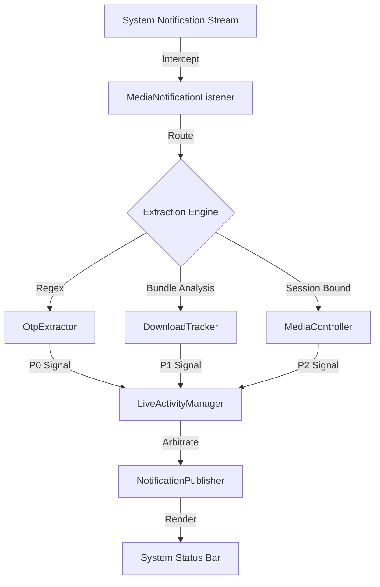

# Beakan

[](https://kotlinlang.org)
[](https://developer.android.com/about/versions/15)
[](https://developer.android.com/guide/components/services)

**Beakan** is a **Proof-of-Concept (POC)** implementing the new **"Live Updates"** feature (technically the **Rich Ongoing Notifications** API, introduced in Android 15 QPR) to replicate iOS-style functionality. It leverages deep system services to intercept high-priority events—such as 2FA codes, active downloads, and media sessions—and promotes them into a unified, interactive status bar chip.

> [!CAUTION]
> **Research Prototype**: This is experimental software designed for developers and enthusiasts. It is **not** a production-ready application.

---

## How It Works

Beakan runs a `NotificationListenerService` in the background. It watches the notification stream, filters for the stuff that matters, and decides what to show based on priority. The UI is completely decoupled from this service.



## Core Modules

### 1. The Listener (`MediaNotificationListener`)
This service connects to Android's notification stream. It filters noise efficiently:
-   **Debouncing**: Ignores rapid updates (like download progress firing every 10ms) to keep the UI smooth.
-   **Classification**: Identifies what kind of notification came in—was it an SMS? A download manager update? A music app?

### 2. OTP Extraction (`OtpExtractor`)
For 2FA codes, we run a local parser on notification text.
-   **Keywords**: Looks for words like "code", "pin", or "login".
-   **Regex**: Uses a few precise patterns to find 4-8 digit numbers. It's smart enough to ignore phone numbers or support ticket IDs.
-   **Privacy**: Everything happens in memory. No data is saved or sent anywhere.

### 3. State Manager (`LiveActivityManager`)
This component decides what to show when multiple things happen at once.

| Priority | Type | Behavior |
| :--- | :--- | :--- |
| **P0** | **OTP / 2FA** | Highest priority. Shows up immediately, then auto-dismisses after 30s. |
| **P1** | **Downloads** | Shows while a file is downloading. Hides when done. |
| **P2** | **Media** | Default state. Shows whenever music or audio is playing. |

### 4. Media Binding
We don't just scrape the notification title. Beakan looks for a `MediaSession` token to talk directly to the music app.
-   **Fast Updates**: Play/Pause buttons work instantly because they use proper system callbacks.
-   **Metadata**: Gets clean album art and track details directly from the session.

## Tech Stack

| Component | Details |
| :--- | :--- |
| **Service** | `NotificationListenerService` (Foreground) |
| **Media** | `MediaSessionCompat` / `MediaController` |
| **Parsing** | Standard Java Regex |
| **State** | Kotlin Singletons |
| **Min SDK** | Android 15 QPR / 16 (API 35+) |

## Supported Environments

| Scope | Specification |
| :--- | :--- |
| **Target OS** | Android 15 (Vanilla AOSP) / Android 16 Developer Preview |
| **Target Device** | Google Pixel Series (Tensor G2+ recommended) |
| **Status** | **Experimental** |

> [!WARNING]
> **OEM Compatibility**: This project is strictly calibrated for **AOSP System UI** behavior. Heavily modified OEM skins (e.g., **Samsung One UI**, **Xiaomi HyperOS**, **ColorOS**) are **not supported**. These environments implement non-standard status bar layouts and aggressive background process termination policies that may break the overlay or kill the service unexpectedly.
: Layout transitions may exhibit frame drops on 60Hz displays or constrained emulator environments.

## Installation Warnings

### 1. Google Play Protect
You will likely be blocked by **Google Play Protect** when installing the debug APK.
*   **Reason**: The app utilizes the `NotificationListenerService` permission to read all notification content (required for OTP and Media interception). Heuristics flag this behavior in unsigned/debug builds as purely malicious.
*   **Resolution**: This is a **false positive** inherent to the nature of this POC. You must select "Install Anyway" to proceed. The source code is entirely local and open for inspection.

### 2. Restricted Settings (Android 13+)
To prevent accessibility abuse, Android 13+ blocks sideloaded apps from enabling high-privilege services.
1.  Install the App.
2.  Go to **Settings > Apps > Beakan**.
3.  Tap the **three-dot menu** in the top-right corner.
4.  Select **"Allow Restricted Settings"**.
5.  *Then* you can enable Notification Access in the system prompts.

## Setup

### Prerequisites
-   Android 15+ AOSP-based device or Emulator.
-   **Manual Step**: Grant "Notification Access" and "Draw Over Other Apps" permissions.

### Install

```bash
git clone https://github.com/yourusername/beakan.git
./gradlew installDebug
```

> **Testing Tip**: Use a real device or a Play Store emulator. You need real apps (like Messages or Spotify) generating notifications to see it work.
